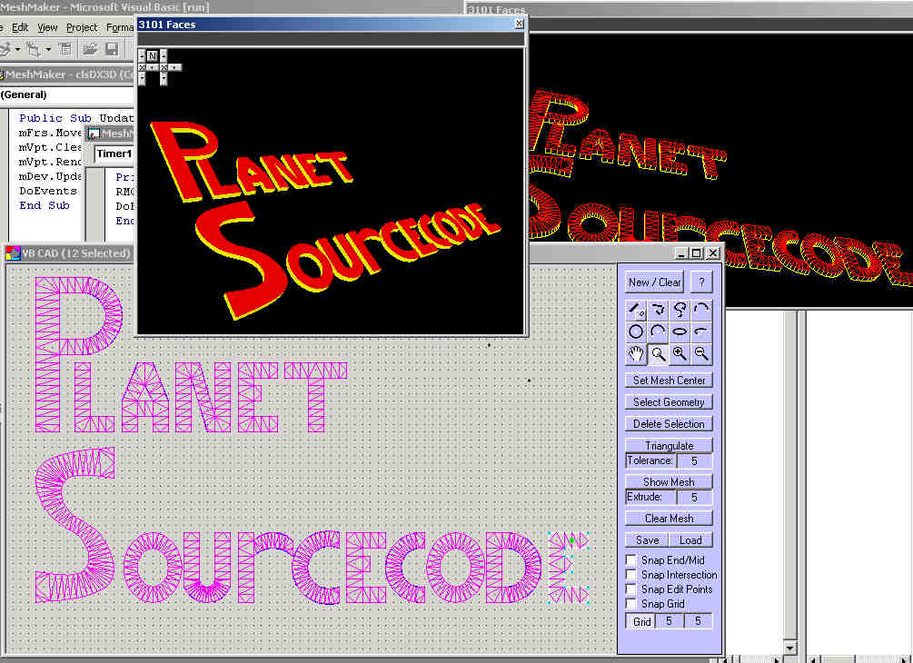

<div align="center">

## VB CAD / Mesh Builder Update 2


</div>

### Description

Automatically Create 3D Mesh Objects

<BR>

VB CAD now supports DXF Import and 3DX Output (for use in your OWN DirectX application) as well as the following functions:

<BR>

DeLaunay Triangulation, Line, Chain, Polyline, Spline, 3-Point Arc, Arc, Circle, Open Ellipse, Ellipse, Grid, Snap To Endpoints, Snap To MidPoints, Snap To Intersection Points, Snap To Edit Points, Snap To Grid, Zoom In, Zoom Out, Zoom Window, Pan.

<BR>

<BR>

If you have ever had a need to create complex mesh objects for a 3D project - or just for fun, then this is the program to use. Just draw your closed geometry, set the fill-point (mesh center) and it will automatically triangulate your object for you using the DeLaunay trianulation method. If you have more than one object, then individually select and triagulate each object (remembering to re-set the mesh center (fill point) for each object. Then you can save the object as a ".X" file for use in other programs.

<BR>

I hope that you enjoy and benefit from this project, and please take a minute to vote for me.

<BR>

Thanks!

<BR>

Code is here on PSC:

http://www.planetsourcecode.com/vb/scripts/ShowCode.asp?txtCodeId=35722&lngWId=1
 
### More Info
 
See Code Located At:

http://www.planetsourcecode.com/vb/scripts/ShowCode.asp?txtCodeId=35722&lngWId=1


<span>             |<span>
---                |---
**Submitted On**   |
**By**             |[Dave Andrews](https://github.com/Planet-Source-Code/PSCIndex/blob/master/ByAuthor/dave-andrews.md)
**Level**          |Advanced
**User Rating**    |4.9 (34 globes from 7 users)
**Compatibility**  |VB 5\.0, VB 6\.0
**Category**       |[Graphics](https://github.com/Planet-Source-Code/PSCIndex/blob/master/ByCategory/graphics__1-46.md)
**World**          |[Visual Basic](https://github.com/Planet-Source-Code/PSCIndex/blob/master/ByWorld/visual-basic.md)
**Archive File**   |[](https://github.com/Planet-Source-Code/dave-andrews-vb-cad-mesh-builder-update-2__1-35853/archive/master.zip)

### API Declarations

```
See Code Located At:
http://www.planetsourcecode.com/vb/scripts/ShowCode.asp?txtCodeId=35722&lngWId=1
```


### Source Code

```
See Code Located At:
http://www.planetsourcecode.com/vb/scripts/ShowCode.asp?txtCodeId=35722&lngWId=1
```

